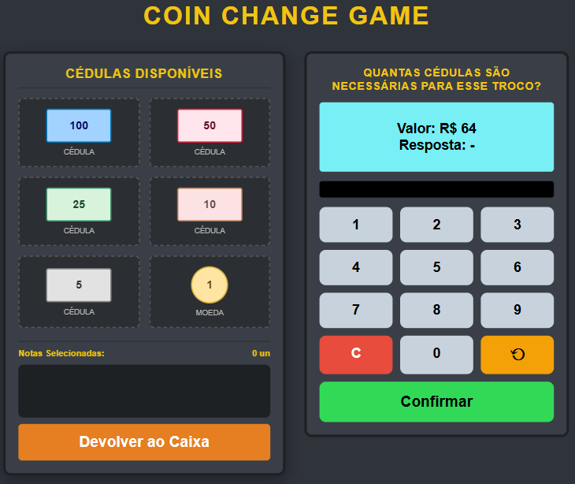
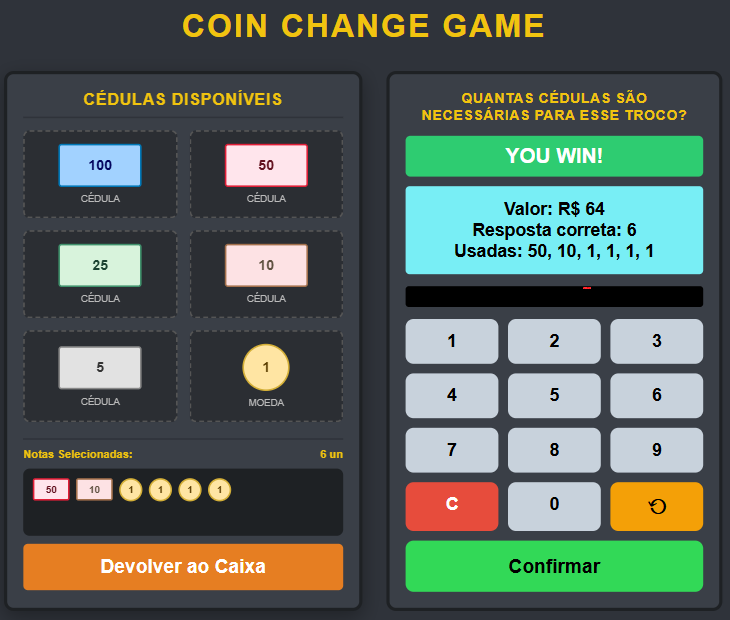
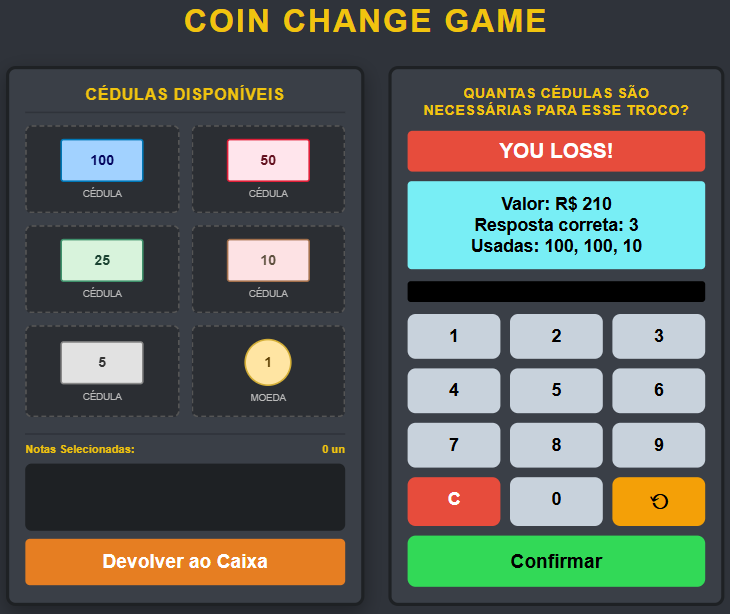

# G12_Greedy_PA-26.1

**Número da Lista**: 12 
**Conteúdo da Disciplina**: Coin Change  

## Alunos
|Matrícula | Aluno |
| -- | -- |
| 23/1037656  |  Arthur Guilherme Aquino Santos |
| 23/1026581  |  Tiago Lemes Teixeira |

## Sobre 

Este projeto implementa um jogo chamado **Coin Change Game**, cujo objetivo é calcular o menor número de cédulas necessárias para formar um valor aleatório exibido na tela. O sistema sorteia um valor entre 50 e 500 reais, e o jogador deve informar, por meio do teclado numérico, quantas cédulas seriam usadas seguindo um conjunto fixo de valores: 100, 50, 25, 10, 5 e 1.

Cada cédula representa uma unidade do sistema de troco, e o algoritmo utilizado aplica uma estratégia ambiciosa (greedy) que sempre seleciona a maior cédula possível antes de passar para as menores. Após o jogador confirmar sua resposta, o programa compara o valor digitado com o número mínimo de cédulas calculado automaticamente.

Caso a resposta esteja correta, o sistema exibe uma mensagem de vitória. Se estiver errada, o jogador vê a solução correta, incluindo o conjunto de cédulas utilizadas.

## Screenshots

### Tela Inicial

### Tela de Vitória

### Tela de Derrota

## Instalação

**Linguagem**: HTML + CSS + JavaScript 

## Uso  

Para executar o projeto, basta abrir o arquivo principal `index.html` em qualquer navegador moderno (Chrome, Firefox, Edge, etc).

Não é necessário compilação ou instalação de dependências.

### Execução

- Abra o arquivo `index.html`
- O jogo será carregado automaticamente no navegador

### Funcionamento  

Ao iniciar o jogo, será exibida uma interface interativa chamada **Coin Change Game**, onde o objetivo é calcular o número mínimo de cédulas necessárias para formar um valor aleatório.

O jogador deve:

- Observar o valor exibido na tela
- Inserir no teclado numérico a quantidade de cédulas necessárias
- Confirmar a resposta

Também é possível:

- Selecionar cédulas disponíveis no caixa (100, 50, 25, 10, 5, 1)
- Visualizar as cédulas acumuladas
- Limpar as cédulas selecionadas
- Reiniciar o desafio

### Regras do Jogo

- O sistema gera automaticamente um valor aleatório entre 50 e 500
- O objetivo é usar o menor número possível de cédulas (algoritmo ambicioso)
- O sistema valida automaticamente a resposta do jogador

### Feedback do Sistema

- “YOU WIN!” → exibido quando a resposta está correta, indicando o valor correto e as cédulas mínimas utilizadas
- “YOU LOSS!” → exibido quando a resposta está incorreta, mostrando a resposta correta e as cédulas mínimas utilizadas
- Sons são reproduzidos para interação e feedback

## Gravação 

A gravação pode ser acessada através do link [https://youtu.be/U3OnuC_pNEE](https://youtu.be/U3OnuC_pNEE).
